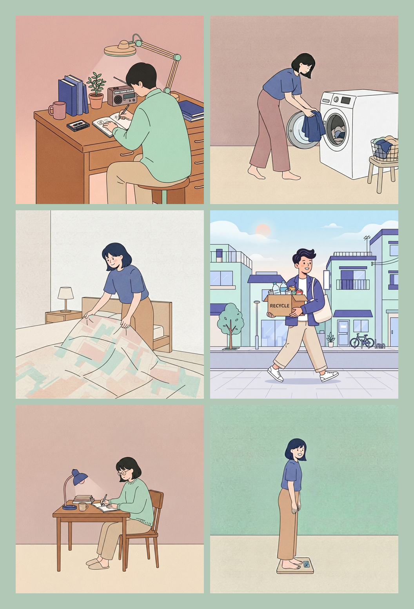
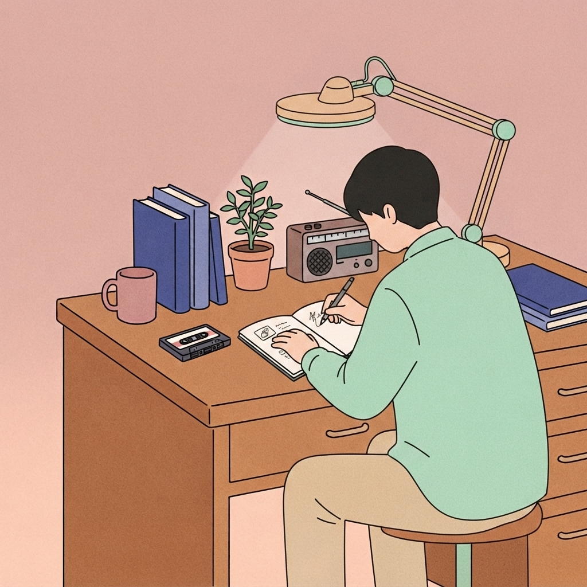

# POKIT

**하루의 루틴을 가볍게 담고, 집중할 시간을 스스로 정해 가는 앱.**

  

  

시간표를 촘촘히 채우지 않아도 됩니다.  
오늘 하고 싶은 루틴만 골라 담고, 그 순서대로 하루를 이어 가세요.

[App Store에서 만나기](https://apps.apple.com/app/id6762331629)

---

## POKIT은 이런 앱이에요

POKIT은 일상의 **루틴**을 주머니에 넣듯 가볍게 모아 두는 iOS 앱입니다.

할 일을 달력에 욱여넣거나, 분 단위 스케줄에 맞추느라 지치지 않아도 됩니다.  
**오늘 무엇을, 어떤 순서로 할지**만 정하면 됩니다. 집중할 구간은 내가 정한 시작과 마무리 안에서 흐릅니다.

떠오른 생각은 노트와 투두로, 읽고 싶은 책은 책방으로,  
하루가 끝나면 히스토리에 작은 기록으로 남습니다.

> 단정하고 산뜻하게 정돈된 하루.

---

  

---

## 하루는 이렇게 흘러가요

**오늘**  
집중할 루틴을 담아 두고, 하루의 시작·마무리 안에서 목록으로 봅니다. 날짜 옆에는 매일 바뀌는 한 줄 응원이 있어요. 담기만 하면 집중이 시작됩니다.

**루틴**  
건강·생산성·일상 루틴을 둘러보고, 검색하고, 포스트잇처럼 묶어 정리합니다. 중요도는 형광펜 밑줄로 남깁니다.

**나만의 루틴**  
데일리·주말·내 그룹을 만들고, 요일을 고른 뒤 「적용하기」로 오늘에 꺼내 씁니다. 한 번 만들어 두면 반복되는 하루가 가벼워집니다.

**히스토리**  
완료한 루틴과 집중을 주간·월간으로 돌아봅니다. 작은 기록이 모여 습관이 보입니다.

**스토리**  
글을 읽다가 마음에 남는 루틴이 있으면, 그대로 저장해 내 하루에 담을 수 있습니다.

오늘 화면 위에서는 **잠금화면 메모**, **노트**, **투두**, **독서**도 함께 쓸 수 있어요. 루틴만으로 하루를 다 담기 어려울 때를 위한 자리입니다.

---

## 왜 시간표가 아닌가요

많은 생산성 앱은 빈칸을 채우라고 합니다.  
POKIT은 반대로, **우선순위만** 묻습니다.

- 오늘 할 것을 **담고**
- 중요한 것은 **밑줄**로 남기고
- 끝난 것은 **완료**로 정리합니다

시작과 마무리 시각으로 오늘의 집중 구간만 둘러 두면,  
그 안에서 루틴이 순서대로 이어집니다. 비어 있는 시간도 실패가 아닙니다.

---

## 디자인

80–90년대 에세이 표지와 레트로 시티팝 일러스트를,  
현대적인 미니멀 플랫 UI로 다시 그렸습니다.

자극적인 대시보드 대신 따뜻한 베이지, 민트, 또렷한 선.  
과한 욕심을 걷어낸 담백함이 POKIT의 무드입니다.

  
  &nbsp;
  

---

## 함께 쓰는 언어

앱 이름 **POKIT**을 제외한 화면 문구는 **한국어 · 영어 · 日本語**를 지원합니다.  
기기 언어가 한국어면 한국어, 일본어면 일본어, 그 외에는 영어로 보여 줍니다.

---

## 플랫폼

POKIT은 **iOS** 앱입니다.  
계정 가입 없이, 내 기기에서 바로 루틴을 담고 집중할 수 있습니다.

[App Store](https://apps.apple.com/app/id6762331629)
